# Plate Mate - System Architecture Documentation

## 📱 Project Overview

**Plate Mate** is an Android mobile application designed to help users discover recipes, plan meals, and organize their cooking journey. The app provides a comprehensive meal planning experience with features for browsing recipes, saving favorites, and scheduling meals for the week ahead.

### 🎯 Key Features

- **Recipe Discovery**: Browse and search thousands of recipes from TheMealDB API
- **Smart Filtering**: Filter meals by category (dessert, seafood, etc.), area/cuisine (Italian, Mexican, etc.), and ingredients
- **Favorites Management**: Save favorite recipes locally for quick access
- **Meal Planning**: Plan breakfast, lunch, and dinner for the next 7 days
- **User Authentication**: Sign in with email/password or Google authentication via Firebase
- **Cloud Sync**: Upload and sync favorites and planned meals to Firebase Firestore
- **Dark Mode**: Toggle between light and dark themes for comfortable viewing
- **Offline Support**: Cached data allows browsing recipes without internet connection

### 🏗️ Architecture

The application follows the **Model-View-Presenter (MVP)** architectural pattern with a clean separation of concerns across three main layers:

- **Presentation Layer**: Views (Fragments/Activities) and Presenters handling UI logic
- **Domain Layer**: Repository interfaces and business models
- **Data Layer**: Local (Room Database, SharedPreferences) and Remote (Retrofit, Firebase) data sources

### 🛠️ Tech Stack

**Android Development**
- Java
- Android SDK
- Material Design Components
- RecyclerView for efficient list rendering
- Navigation Component for screen navigation

**Architecture & Patterns**
- MVP (Model-View-Presenter)
- Repository Pattern
- Singleton Pattern
- Observer Pattern

**Data Persistence**
- Room Database (local SQLite storage)
- SharedPreferences (caching and user preferences)

**Networking & APIs**
- Retrofit 2 (REST API client)
- RxJava 3 (reactive programming)
- Gson (JSON serialization)
- TheMealDB API (recipe data)

**Backend & Authentication**
- Firebase Authentication (email/password, Google Sign-In)
- Firebase Firestore (cloud data sync)

**Dependency Injection**
- Manual DI (constructor injection)

### 📊 Data Flow

1. **Initial Load**: App preloads categories, areas, ingredients, and sample meals on first launch
2. **Caching**: Data is cached in SharedPreferences for offline access
3. **User Actions**: Favorites and planned meals are stored in Room Database
4. **Cloud Sync**: Users can upload their local data to Firebase for backup/sync across devices

### 👥 User Journey

1. **Onboarding**: First-time users see onboarding screens introducing app features
2. **Authentication**: Users can sign in or continue as guest (limited features)
3. **Home**: Browse featured meals, filter by category/area/ingredient, search recipes
4. **Meal Details**: View full recipe with ingredients, measurements, and cooking instructions
5. **Saved**: Access all favorited recipes in one place
6. **Planner**: Schedule meals for the next 7 days (breakfast, lunch, dinner)
7. **Profile**: Manage account, toggle dark mode, sync data to cloud, sign out

---

## 📐 Architecture Diagrams

## 1. High-Level Layered Architecture

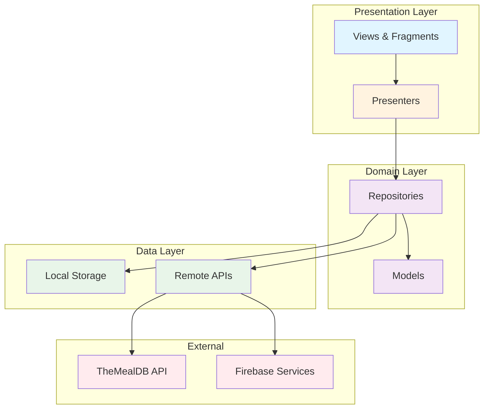

## 2. MVP Pattern - Home Feature

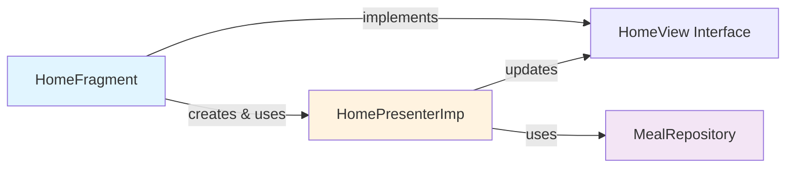

## 3. MVP Pattern - Saved Feature

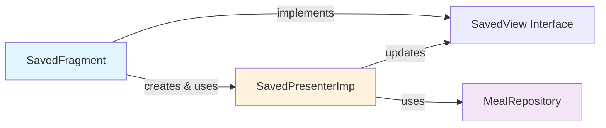

## 4. MVP Pattern - Planner Feature

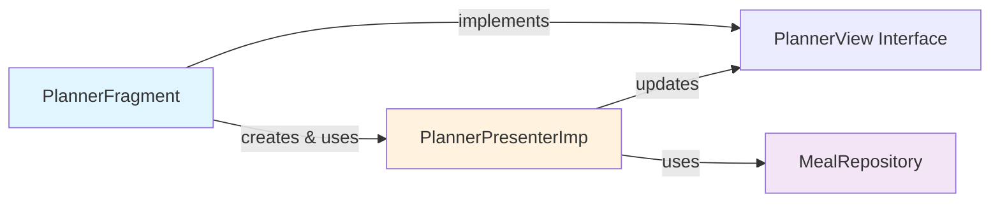

## 5. MVP Pattern - Profile Feature

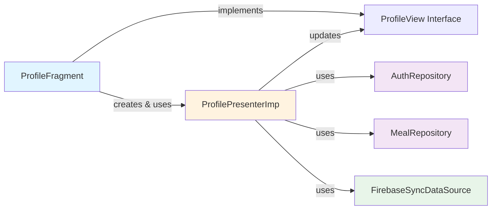

## 6. Repository Layer - MealRepository

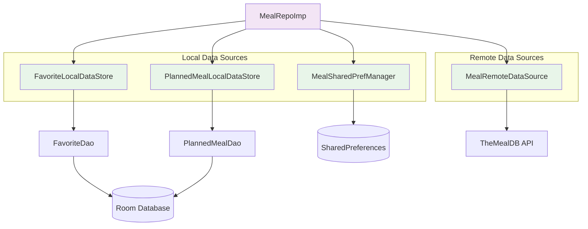

## 7. Repository Layer - AuthRepository

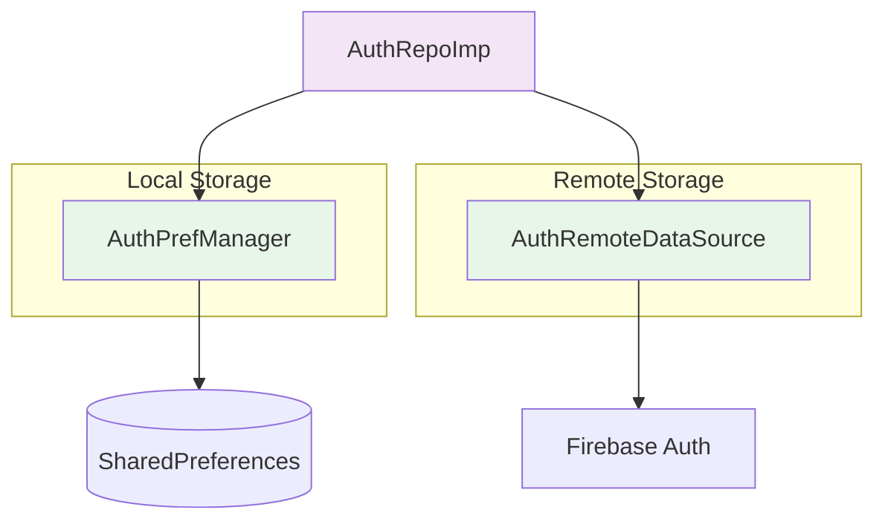

---

## 8. Database Schema - Core Tables

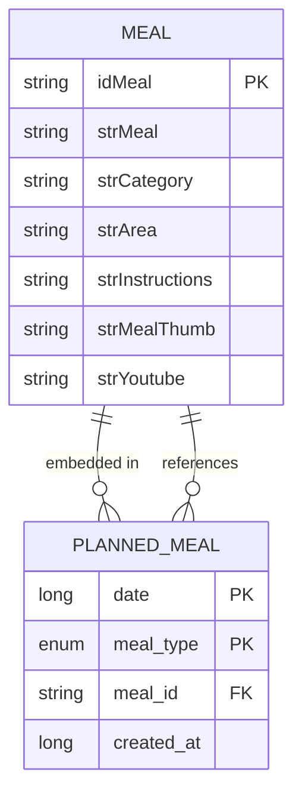

## 9. Database Schema - Meal Ingredients (20 fields)

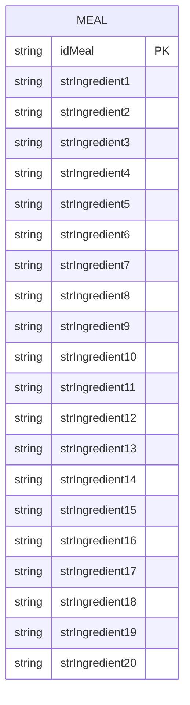

## 10. Database Schema - Meal Measures (20 fields)

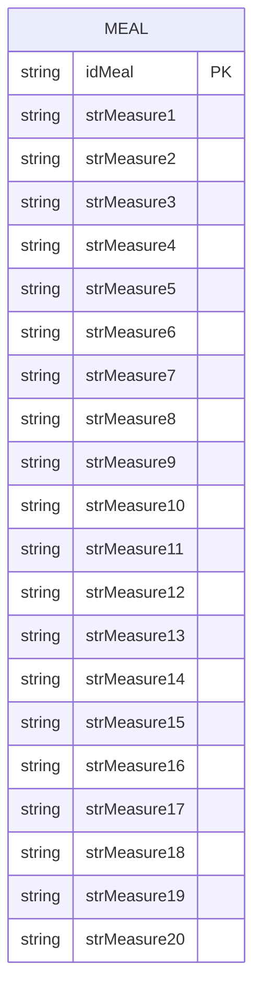

## 11. Database Schema - Firebase Collections

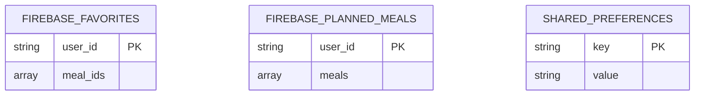

---

## 12. UML Class Diagram - Domain Models

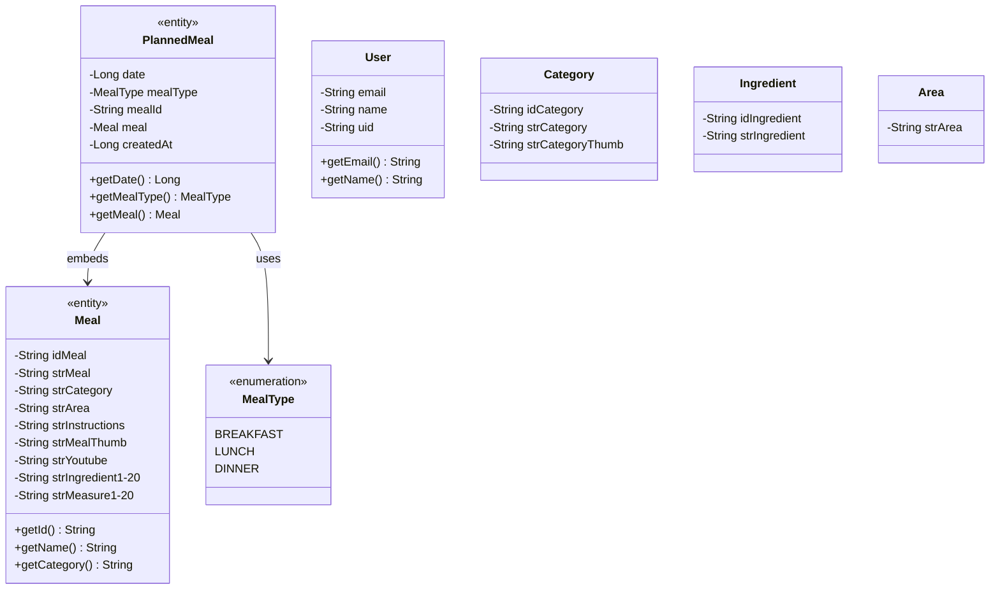

## 13. UML - Home Feature

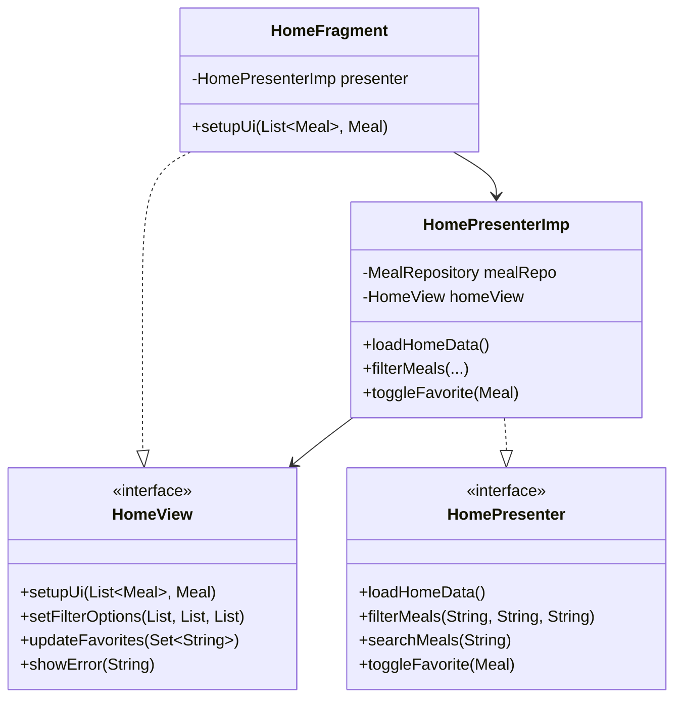

## 14. UML - Saved Feature

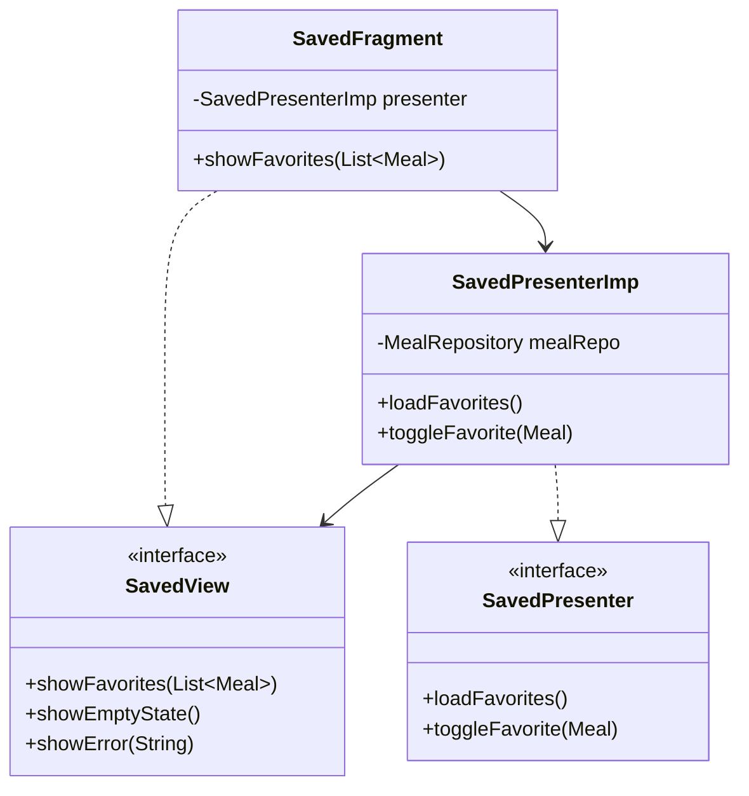

## 15. UML - Planner Feature

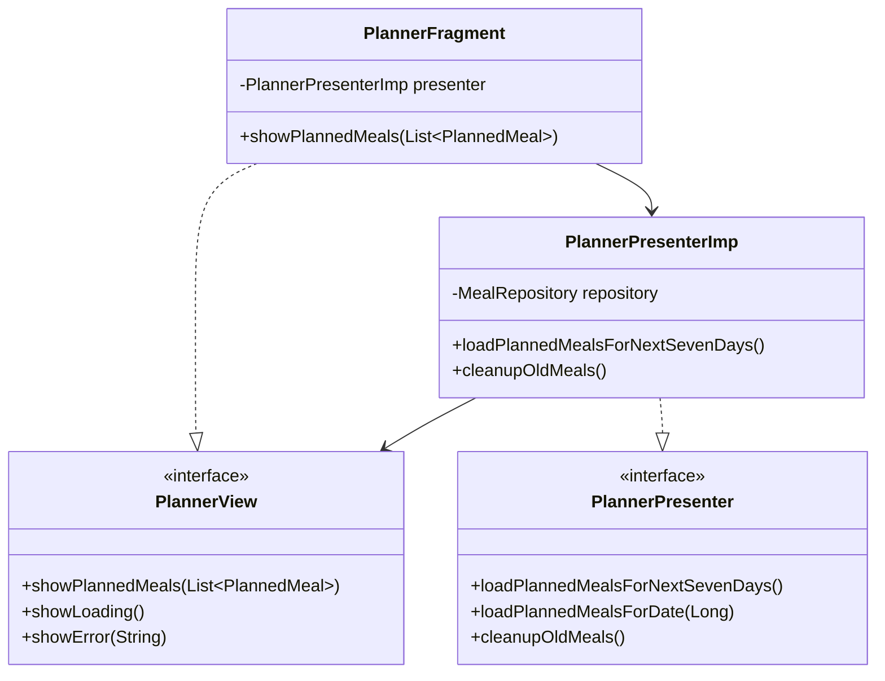

## 16. UML - Profile Feature

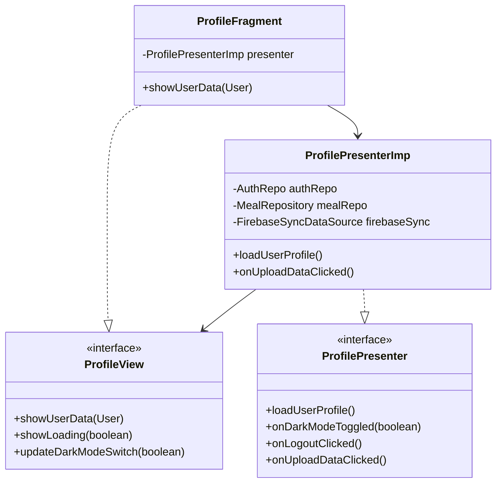

## 17. UML - Repository Implementation

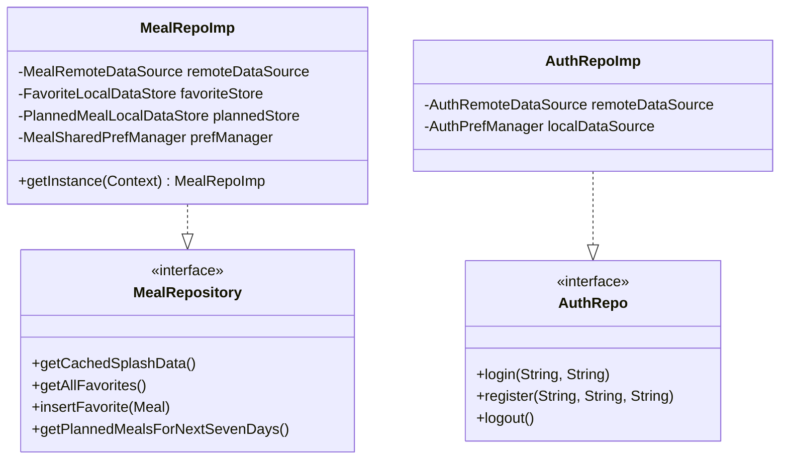

## 18. UML - Local Data Sources

```mermaidclassDiagram
    class MealsDatabase {
        <<abstract>>
        +favoriteDao() FavoriteDao
        +plannedMealDao() PlannedMealDao
    }

    class FavoriteDao {
        <<interface>>
        +insertFavorite(meal: Meal) : void
        +getAllFavorites() : List~Meal~
        +deleteFavorite(mealId: String) : void
        +deleteAllFavorites() : void
    }

    class PlannedMealDao {
        <<interface>>
        +insertPlannedMeal(plannedMeal: PlannedMeal) : void
        +getPlannedMealsInRange(start: Long, end: Long) : List~PlannedMeal~
        +deletePlannedMeal(id: String) : void
        +deleteOldPlannedMeals(before: Long) : void
    }

    class FavoriteLocalDataSource {
        -favoriteDao: FavoriteDao
        +insertFavorite(meal: Meal)
        +getAllFavorites()
        +deleteFavorite(mealId: String)
    }

    class PlannedMealLocalDataSource {
        -plannedMealDao: PlannedMealDao
        +insertPlannedMeal(plannedMeal: PlannedMeal)
        +getPlannedMealsInRange(start: Long, end: Long)
        +deleteOldPlannedMeals(before: Long)
    }

    class MealSharedPrefManager {
        -sharedPreferences: SharedPreferences
        +saveInitialData(data: InitialMealData)
        +getCachedInitialData() : InitialMealData
        +clearInitialData()
    }

    class AuthPrefManager {
        -sharedPreferences: SharedPreferences
        +saveUserSession(userId: String, token: String)
        +getUserId() : String
        +isLoggedIn() : boolean
        +clearSession()
    }

    MealsDatabase --> FavoriteDao
    MealsDatabase --> PlannedMealDao
    FavoriteLocalDataSource --> FavoriteDao
    PlannedMealLocalDataSource --> PlannedMealDao

```

## 19. UML - Remote Data Sources

```mermaidclassDiagram
    class MealRemoteDataSource {
        -mealService: MealService
        +listCategories() : Single~CategoryResponse~
        +filterByCategory(category: String) : Single~MealResponse~
        +searchMealByName(name: String) : Single~MealResponse~
        +getMealById(id: String) : Single~MealDetailsResponse~
        +getRandomMeal() : Single~MealDetailsResponse~
    }

    class MealService {
        <<interface>>
        +listCategories()
        +searchByCategory(category: String)
        +searchByName(name: String)
        +getMealById(id: String)
        +getRandomMeal()
    }

    class RetrofitClient {
        +getMealApiService() : MealService
    }

    class AuthRemoteDataSource {
        -firebaseAuth: FirebaseAuth
        +signIn(email: String, password: String)
        +signUp(email: String, password: String)
        +logout()
        +getCurrentUser() : FirebaseUser
    }

    class FirebaseSyncDataSource {
        -firestore: FirebaseFirestore
        +fetchUserFavorites(userId: String)
        +uploadFavorites(favorites: List~Meal~, userId: String)
        +fetchUserPlannedMeals(userId: String)
        +uploadPlannedMeals(plannedMeals: List~PlannedMeal~, userId: String)
    }

    MealRemoteDataSource --> MealService
    RetrofitClient --> MealService
    AuthRemoteDataSource --> FirebaseAuth
    FirebaseSyncDataSource --> FirebaseFirestore

```

## 20. Data Flow - Add Favorite

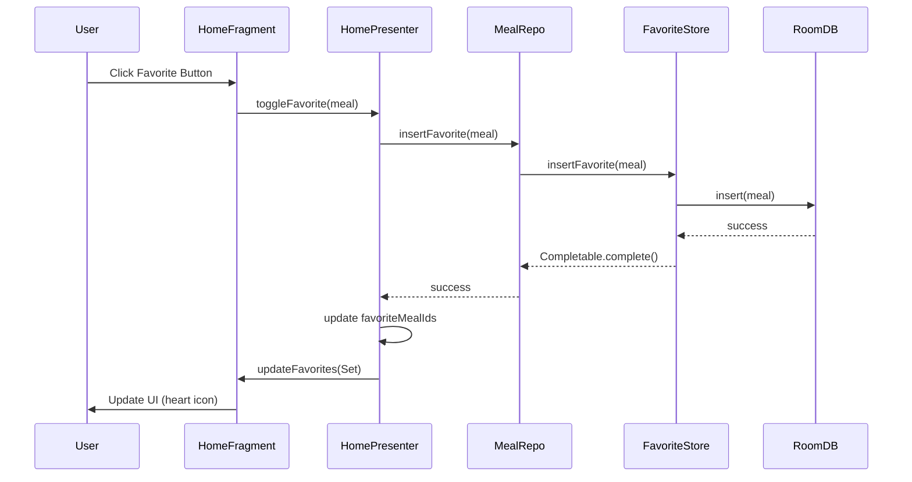

## 21. Data Flow - Load Planned Meals

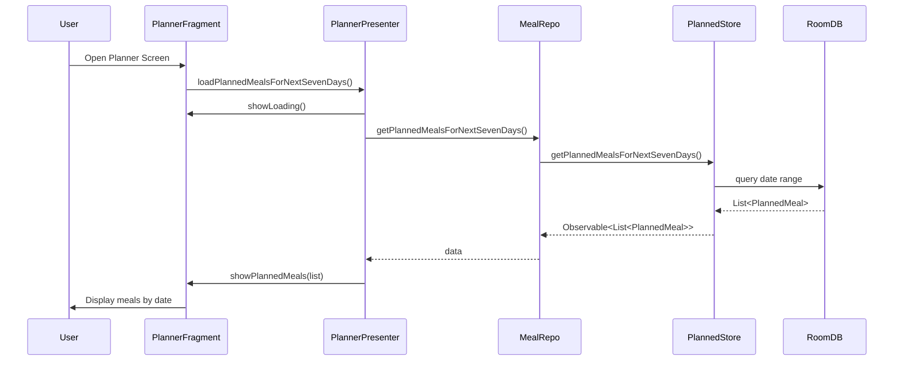

## 22. Data Flow - Firebase Sync

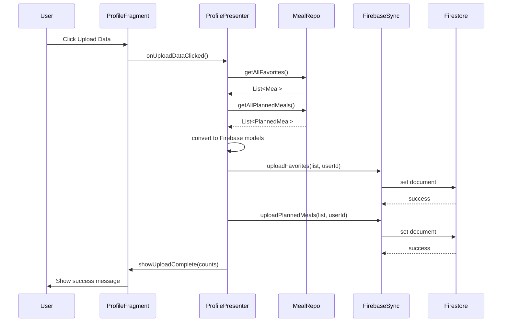
