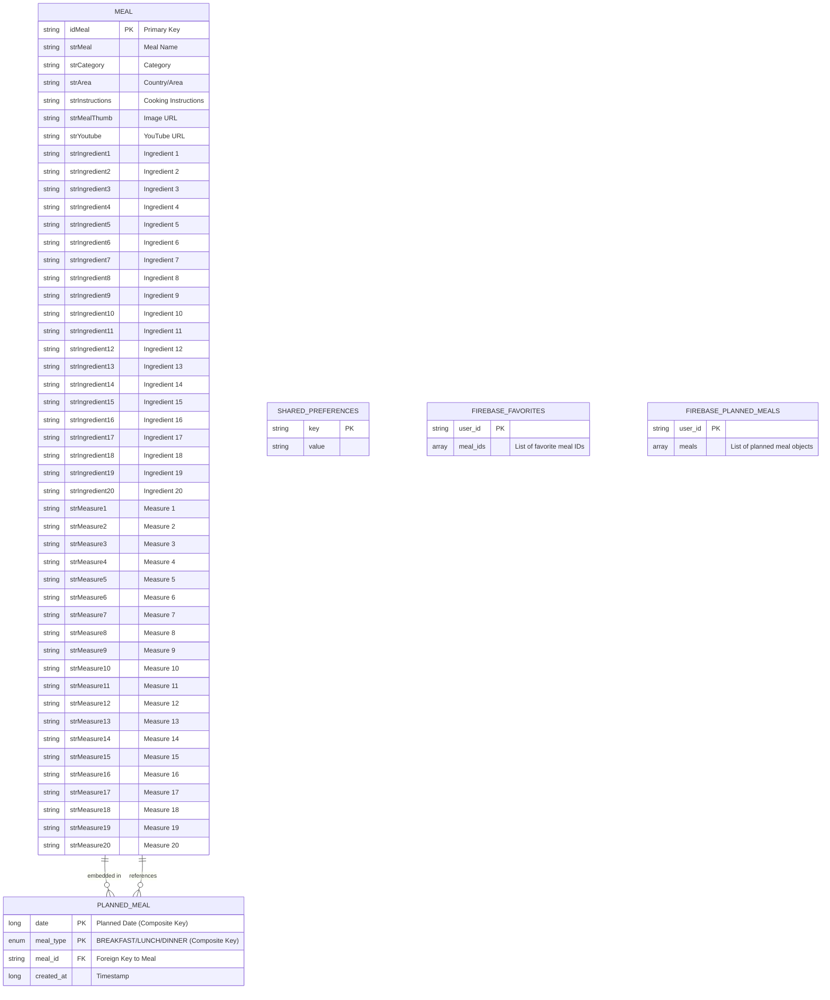

# Plate Mate - System Architecture Documentation

## 1. Layered Architecture (MVP Pattern)

```mermaid
graph TB
    subgraph "Presentation Layer"
        V[Views/Fragments]
        P[Presenters]
        A[Activities]
        
        V1[HomeFragment]
        V2[SavedFragment]
        V3[PlannerFragment]
        V4[ProfileFragment]
        V5[MealDetailsFragment]
        V6[SignInFragment]
        V7[SignUpFragment]
        
        P1[HomePresenterImp]
        P2[SavedPresenterImp]
        P3[PlannerPresenterImp]
        P4[ProfilePresenterImp]
        P5[MealDetailsPresenter]
        P6[SignInPresenterImp]
        P7[SignUpPresenterImp]
        P8[SplashPresenterImp]
        
        A1[MainActivity]
        A2[AuthActivity]
        A3[SplashActivity]
        A4[OnboardingActivity]
    end
    
    subgraph "Domain Layer"
        R[Repositories]
        M[Models]
        
        R1[MealRepository]
        R2[AuthRepository]
        
        M1[Meal]
        M2[PlannedMeal]
        M3[User]
        M4[Category]
        M5[Ingredient]
        M6[Area]
    end
    
    subgraph "Data Layer"
        DS[Data Sources]
        
        subgraph "Local Data Sources"
            L1[Room Database]
            L2[SharedPreferences]
            L3[FavoriteDao]
            L4[PlannedMealDao]
            L5[MealSharedPrefManager]
            L6[AuthPrefManager]
        end
        
        subgraph "Remote Data Sources"
            R3[Retrofit API]
            R4[Firebase Auth]
            R5[Firestore]
            R6[MealService]
            R7[AuthRemoteDataSource]
            R8[FirebaseSyncDataSource]
        end
    end
    
    subgraph "External Services"
        API[TheMealDB API]
        FB[Firebase]
    end
    
    V --> P
    A --> V
    P --> R
    R --> DS
    R --> M
    DS --> L1
    DS --> L2
    DS --> R3
    DS --> R4
    DS --> R5
    R3 --> API
    R4 --> FB
    R5 --> FB
    
    style V fill:#e1f5ff
    style P fill:#fff3e0
    style R fill:#f3e5f5
    style DS fill:#e8f5e9
    style API fill:#ffebee
    style FB fill:#ffebee
```



---

## 2. Database Schema



---

## 3. UML Class Diagram

```mermaid
classDiagram
    %% Presentation Layer - MVP Pattern
    class HomeView {
        <<interface>>
        +setupUi(List~Meal~ meals, Meal hero)
        +setFilterOptions(List categories, areas, ingredients)
        +updateFavorites(Set~String~ favoriteIds)
        +showError(String message)
    }
    
    class HomePresenter {
        <<interface>>
        +loadHomeData()
        +filterMeals(String category, area, ingredient)
        +searchMeals(String query)
        +toggleFavorite(Meal meal)
        +loadFavorites()
        +clearAllFilters()
    }
    
    class HomePresenterImp {
        -MealRepository mealRepo
        -HomeView homeView
        -Set~String~ favoriteMealIds
        -CompositeDisposable disposables
        +attachView(HomeView view)
        +detachView()
        +loadHomeData()
        +filterMeals(String category, area, ingredient)
        +searchMeals(String query)
        +toggleFavorite(Meal meal)
    }
    
    class HomeFragment {
        -HomePresenterImp presenter
        -MealAdapter adapter
        -RecyclerView recyclerView
        +onCreate(Bundle savedInstanceState)
        +onViewCreated(View view, Bundle savedInstanceState)
        +setupUi(List~Meal~ meals, Meal hero)
        +updateFavorites(Set~String~ favoriteIds)
    }
    
    class SavedView {
        <<interface>>
        +showFavorites(List~Meal~ favorites)
        +updateFavorites(Set~String~ favoriteIds)
        +showEmptyState()
        +hideEmptyState()
        +showError(String message)
    }
    
    class SavedPresenter {
        <<interface>>
        +loadFavorites()
        +toggleFavorite(Meal meal)
        +dispose()
    }
    
    class SavedPresenterImp {
        -MealRepository mealRepo
        -SavedView savedView
        -Set~String~ favoriteMealIds
        -CompositeDisposable disposables
        +loadFavorites()
        +toggleFavorite(Meal meal)
    }
    
    class SavedFragment {
        -SavedPresenterImp presenter
        -MealAdapter adapter
        +showFavorites(List~Meal~ favorites)
        +showEmptyState()
    }
    
    class PlannerView {
        <<interface>>
        +showPlannedMeals(List~PlannedMeal~ meals)
        +showPlannedMealsForDate(Long date, List~PlannedMeal~ meals)
        +showLoading()
        +hideLoading()
        +showError(String message)
        +showSuccess(String message)
        +showEmptyState()
    }
    
    class PlannerPresenter {
        <<interface>>
        +attachView(PlannerView view)
        +detachView()
        +loadPlannedMealsForNextSevenDays()
        +loadPlannedMealsForDate(Long date)
        +cleanupOldMeals()
    }
    
    class PlannerPresenterImp {
        -MealRepository repository
        -PlannerView view
        -CompositeDisposable disposables
        +loadPlannedMealsForNextSevenDays()
        +loadPlannedMealsForDate(Long date)
        +cleanupOldMeals()
    }
    
    class PlannerFragment {
        -PlannerPresenterImp presenter
        -RecyclerView recyclerView
        +showPlannedMeals(List~PlannedMeal~ meals)
        +showEmptyState()
    }
    
    class ProfileView {
        <<interface>>
        +showUserData(User user)
        +showLoading(boolean isLoading)
        +showError(String message)
        +showSuccess(String message)
        +navigateToLogin()
        +updateDarkModeSwitch(boolean isEnabled)
        +showUploadComplete(int favs, int planned)
    }
    
    class ProfilePresenter {
        <<interface>>
        +attachView(ProfileView view)
        +detachView()
        +loadUserProfile()
        +onDarkModeToggled(boolean isEnabled)
        +onResetPasswordClicked()
        +onLogoutClicked()
        +onUploadDataClicked()
    }
    
    class ProfilePresenterImp {
        -AuthRepo authRepo
        -AuthRemoteDataSource remoteDataSource
        -MealRepository mealRepository
        -FirebaseSyncDataSource firebaseSyncDataSource
        -ProfileView view
        +loadUserProfile()
        +onDarkModeToggled(boolean isEnabled)
        +onLogoutClicked()
        +onUploadDataClicked()
    }
    
    class ProfileFragment {
        -ProfilePresenterImp presenter
        -SwitchMaterial darkModeSwitch
        +showUserData(User user)
        +updateDarkModeSwitch(boolean isEnabled)
    }
    
    %% Domain Layer - Models
    class Meal {
        <<entity>>
        -String idMeal
        -String strMeal
        -String strCategory
        -String strArea
        -String strInstructions
        -String strMealThumb
        -String strYoutube
        -String strIngredient1-20
        -String strMeasure1-20
        +getters()
        +setters()
    }
    
    class PlannedMeal {
        <<entity>>
        -Long date
        -MealType mealType
        -String mealId
        -Meal meal
        -Long createdAt
        +getters()
        +setters()
    }
    
    class User {
        -String email
        -String name
        -String uid
        +getters()
        +setters()
    }
    
    class MealType {
        <<enumeration>>
        BREAKFAST
        LUNCH
        DINNER
    }
    
    class Category {
        -String idCategory
        -String strCategory
        -String strCategoryThumb
        -String strCategoryDescription
    }
    
    class Ingredient {
        -String idIngredient
        -String strIngredient
        -String strDescription
    }
    
    class Area {
        -String strArea
    }
    
    class InitialMealData {
        -CategoryResponse categories
        -MealResponse meals
        -AreaResponse areas
        -IngredientResponse ingredients
        -MealResponse randomMeal
    }
    
    %% Repository Layer
    class MealRepository {
        <<interface>>
        +preloadInitialData() Completable
        +getCachedSplashData() Single~InitialMealData~
        +searchMealsByCategory(String) Single~MealResponse~
        +searchMealsByArea(String) Single~MealResponse~
        +searchMealsByIngredient(String) Single~MealResponse~
        +SearchMealsByName(String) Observable~MealResponse~
        +getMealById(String) Single~MealResponse~
        +insertFavorite(Meal) Completable
        +getAllFavorites() Observable~List~Meal~~
        +deleteFavorite(String) Completable
        +insertPlannedMeal(PlannedMeal) Completable
        +getPlannedMealsForNextSevenDays() Observable~List~PlannedMeal~~
        +getPlannedMealsByDate(Long) Single~List~PlannedMeal~~
        +getAllPlannedMeals() Observable~List~PlannedMeal~~
        +cleanupOldPlannedMeals() Completable
        +deleteAllPlannedMeals() Completable
    }
    
    class MealRepoImp {
        -MealRemoteDataSource remoteDataSource
        -MealSharedPrefManager dataStoreManager
        -FavoriteLocalDataStore favoriteLocalDataStore
        -PlannedMealLocalDataStore plannedMealLocalDataStore
        +getInstance(Context) MealRepoImp
        +preloadInitialData() Completable
        +getCachedSplashData() Single~InitialMealData~
        +searchMealsByCategory(String) Single~MealResponse~
        +insertFavorite(Meal) Completable
        +getAllFavorites() Observable~List~Meal~~
    }
    
    class AuthRepo {
        <<interface>>
        +login(String email, String password) Completable
        +register(String name, String email, String password) Completable
        +loginWithGoogle(String idToken) Completable
        +logout() Completable
        +isUserLoggedIn() boolean
        +setDarkMode(boolean isEnabled)
        +isDarkModeEnabled() boolean
    }
    
    class AuthRepoImp {
        -AuthRemoteDataSource remoteDataSource
        -AuthPrefManager localDataSource
        +login(String email, String password) Completable
        +register(String name, String email, String password) Completable
        +logout() Completable
        +isUserLoggedIn() boolean
    }
    
    %% Data Layer - Local Storage
    class MealsDatabase {
        <<abstract>>
        +getInstance(Context) MealsDatabase
        +favoriteDao() FavoriteDao
        +plannedMealDao() PlannedMealDao
    }
    
    class FavoriteDao {
        <<interface>>
        +insertFavorite(Meal)
        +getAllFavorites() Observable~List~Meal~~
        +getFavoriteById(String) Meal
        +deleteFavorite(String)
    }
    
    class PlannedMealDao {
        <<interface>>
        +insertPlannedMeal(PlannedMeal)
        +insertPlannedMeals(List~PlannedMeal~)
        +updatePlannedMeal(PlannedMeal)
        +deletePlannedMeal(PlannedMeal)
        +deletePlannedMealByDateAndType(Long, MealType)
        +getPlannedMealsInRange(Long, Long) Observable~List~PlannedMeal~~
        +getPlannedMealsByDate(Long) Single~List~PlannedMeal~~
        +getPlannedMealByDateAndType(Long, MealType) Single~PlannedMeal~
        +getAllPlannedMeals() Observable~List~PlannedMeal~~
        +deleteOldPlannedMeals(Long)
        +deleteAllPlannedMeals()
    }
    
    class FavoriteLocalDataStore {
        -FavoriteDao favoriteDao
        +insertFavorite(Meal)
        +getAllFavorites() Observable~List~Meal~~
        +getFavoriteById(String) Meal
        +deleteFavorite(String)
    }
    
    class PlannedMealLocalDataStore {
        -PlannedMealDao plannedMealDao
        +insertPlannedMeal(PlannedMeal)
        +getPlannedMealsForNextSevenDays() Observable~List~PlannedMeal~~
        +getPlannedMealsByDate(Long) Single~List~PlannedMeal~~
        +cleanupOldPlannedMeals()
    }
    
    class MealSharedPrefManager {
        -SharedPreferences sharedPreferences
        -Gson gson
        +getInstance(Context) MealSharedPrefManager
        +saveInitialData(InitialMealData) Completable
        +getCachedInitialData() Single~InitialMealData~
    }
    
    class AuthPrefManager {
        -SharedPreferences sharedPreferences
        +getInstance(Context) AuthPrefManager
        +saveUserSession(String uid, String email, boolean isGuest)
        +isLoggedIn() boolean
        +clearSession()
        +setDarkMode(boolean isEnabled)
        +isDarkModeEnabled() boolean
    }
    
    class Converters {
        +fromMealTypeString(String) MealType
        +mealTypeToString(MealType) String
    }
    
    %% Data Layer - Remote Storage
    class MealRemoteDataSource {
        -MealService mealService
        +listCategories() Observable~CategoryResponse~
        +listIngredients() Observable~IngredientResponse~
        +listAreas() Observable~AreaResponse~
        +searchMealByFirstLetter(String) Observable~MealResponse~
        +getRandomMeal() Observable~MealResponse~
        +filterByCategory(String) Single~MealResponse~
        +filterByArea(String) Single~MealResponse~
        +filterByIngredient(String) Single~MealResponse~
        +searchMealByName(String) Observable~MealResponse~
        +getMealById(String) Single~MealResponse~
    }
    
    class MealService {
        <<interface>>
        +listCategories() Observable~CategoryResponse~
        +listAreas() Observable~AreaResponse~
        +listIngredients() Observable~IngredientResponse~
        +searchByCategory(String) Single~MealResponse~
        +searchByArea(String) Single~MealResponse~
        +searchByIngredient(String) Single~MealResponse~
        +searchByName(String) Observable~MealResponse~
        +getMealById(String) Single~MealResponse~
        +getRandomMeal() Observable~MealResponse~
        +searchByFirstLetter(String) Observable~MealResponse~
    }
    
    class RetrofitClient {
        -Retrofit retrofit
        +getMealApiService() MealService
    }
    
    class AuthRemoteDataSource {
        -FirebaseAuth firebaseAuth
        +signIn(String email, String password) Completable
        +signInWithGoogle(String idToken) Completable
        +signUp(String email, String password) Completable
        +updateUserProfile(String displayName, String photoUrl) Completable
        +logout()
        +isUserLoggedIn() Single~Boolean~
        +getCurrentUser() FirebaseUser
    }
    
    class FirebaseSyncDataSource {
        -FirebaseFirestore firestore
        +fetchUserFavorites(String userId) Single~List~FirebaseFavorite~~
        +fetchUserPlannedMeals(String userId) Single~List~FirebasePlannedMeal~~
        +uploadFavorites(List~FirebaseFavorite~, String userId) Completable
        +uploadPlannedMeals(List~FirebasePlannedMeal~, String userId) Completable
    }
    
    %% Relationships - Presentation Layer
    HomeFragment ..|> HomeView
    HomePresenterImp ..|> HomePresenter
    HomeFragment --> HomePresenterImp : uses
    HomePresenterImp --> HomeView : updates
    HomePresenterImp --> MealRepository : uses
    
    SavedFragment ..|> SavedView
    SavedPresenterImp ..|> SavedPresenter
    SavedFragment --> SavedPresenterImp : uses
    SavedPresenterImp --> SavedView : updates
    SavedPresenterImp --> MealRepository : uses
    
    PlannerFragment ..|> PlannerView
    PlannerPresenterImp ..|> PlannerPresenter
    PlannerFragment --> PlannerPresenterImp : uses
    PlannerPresenterImp --> PlannerView : updates
    PlannerPresenterImp --> MealRepository : uses
    
    ProfileFragment ..|> ProfileView
    ProfilePresenterImp ..|> ProfilePresenter
    ProfileFragment --> ProfilePresenterImp : uses
    ProfilePresenterImp --> ProfileView : updates
    ProfilePresenterImp --> AuthRepo : uses
    ProfilePresenterImp --> MealRepository : uses
    ProfilePresenterImp --> FirebaseSyncDataSource : uses
    
    %% Relationships - Repository Layer
    MealRepoImp ..|> MealRepository
    MealRepoImp --> MealRemoteDataSource : uses
    MealRepoImp --> FavoriteLocalDataStore : uses
    MealRepoImp --> PlannedMealLocalDataStore : uses
    MealRepoImp --> MealSharedPrefManager : uses
    
    AuthRepoImp ..|> AuthRepo
    AuthRepoImp --> AuthRemoteDataSource : uses
    AuthRepoImp --> AuthPrefManager : uses
    
    %% Relationships - Data Layer
    FavoriteLocalDataStore --> FavoriteDao : uses
    PlannedMealLocalDataStore --> PlannedMealDao : uses
    FavoriteDao --> Meal : operates on
    PlannedMealDao --> PlannedMeal : operates on
    MealsDatabase --> FavoriteDao : provides
    MealsDatabase --> PlannedMealDao : provides
    MealsDatabase --> Converters : uses
    
    MealRemoteDataSource --> MealService : uses
    RetrofitClient --> MealService : creates
    
    %% Model Relationships
    PlannedMeal --> Meal : embeds
    PlannedMeal --> MealType : uses
    Meal --> Category : belongs to
    Meal --> Area : belongs to
    Meal --> Ingredient : contains
