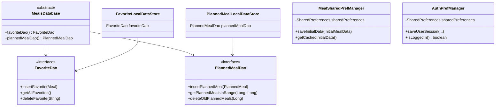
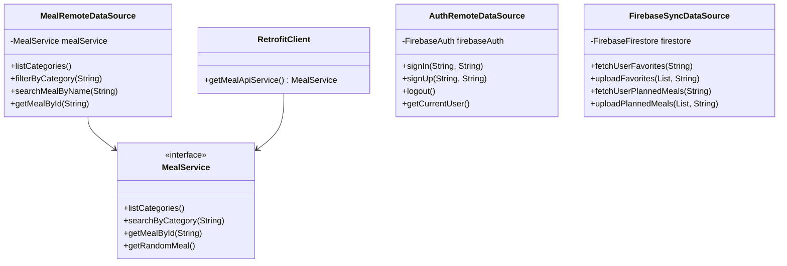

# Plate Mate - System Architecture Documentation

## 1. High-Level Layered Architecture


## 2. MVP Pattern - Home Feature


## 3. MVP Pattern - Saved Feature


## 4. MVP Pattern - Planner Feature


## 5. MVP Pattern - Profile Feature


## 6. Repository Layer - MealRepository


## 7. Repository Layer - AuthRepository


---

## 8. Database Schema - Core Tables


## 9. Database Schema - Meal Ingredients (20 fields)


## 10. Database Schema - Meal Measures (20 fields)


## 11. Database Schema - Firebase Collections


---

## 12. UML Class Diagram - Domain Models


## 13. UML - Home Feature


## 14. UML - Saved Feature


## 15. UML - Planner Feature


## 16. UML - Profile Feature


## 17. UML - Repository Implementation


## 18. UML - Local Data Sources



## 19. UML - Remote Data Sources



## 20. Data Flow - Add Favorite


## 21. Data Flow - Load Planned Meals

```mermaid
sequenceDiagram
    participant User
    participant PlannerFragment
    participant PlannerPresenter
    participant MealRepo
    participant PlannedStore
    participant RoomDB
    
    User->>PlannerFragment: Open Planner Screen
    PlannerFragment->>PlannerPresenter: loadPlannedMealsForNextSevenDays()
    PlannerPresenter->>PlannerFragment: showLoading()
    PlannerPresenter->>MealRepo: getPlannedMealsForNextSevenDays()
    MealRepo->>PlannedStore: getPlannedMealsForNextSevenDays()
    PlannedStore->>RoomDB: query date range
    RoomDB-->>PlannedStore: List<PlannedMeal>
    PlannedStore-->>MealRepo: Observable<List<PlannedMeal>>
    MealRepo-->>PlannerPresenter: data
    PlannerPresenter->>PlannerFragment: showPlannedMeals(list)
    PlannerFragment->>User: Display meals by date
```

## 22. Data Flow - Firebase Sync

```mermaid
sequenceDiagram
    participant User
    participant ProfileFragment
    participant ProfilePresenter
    participant MealRepo
    participant FirebaseSync
    participant Firestore
    
    User->>ProfileFragment: Click Upload Data
    ProfileFragment->>ProfilePresenter: onUploadDataClicked()
    ProfilePresenter->>MealRepo: getAllFavorites()
    MealRepo-->>ProfilePresenter: List<Meal>
    ProfilePresenter->>MealRepo: getAllPlannedMeals()
    MealRepo-->>ProfilePresenter: List<PlannedMeal>
    ProfilePresenter->>ProfilePresenter: convert to Firebase models
    ProfilePresenter->>FirebaseSync: uploadFavorites(list, userId)
    FirebaseSync->>Firestore: set document
    Firestore-->>FirebaseSync: success
    ProfilePresenter->>FirebaseSync: uploadPlannedMeals(list, userId)
    FirebaseSync->>Firestore: set document
    Firestore-->>FirebaseSync: success
    ProfilePresenter->>ProfileFragment: showUploadComplete(counts)
    ProfileFragment->>User: Show success message
```
